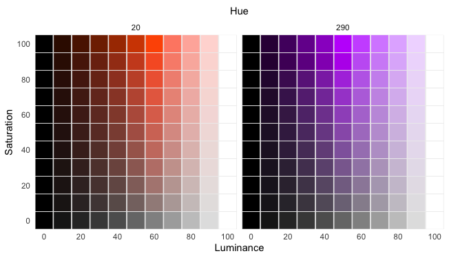

# hsluv-rcpp
Rcpp implementation of HSLuv

## Introduction

HSLuv is a human-friendly way to describe hue, saturation, and luminance --- three attributes of color. The library includes functions to convert this colorspace to computer RGB as separate red, green, and blue values and as a hex code.

## Installation

To install, you will need a working toolchain on your computer for compiling C++ code, and the R package devtools installed. Once those are working, simply run the following code in an R session:

```
devtools::install_github("ssp3nc3r/hsluv-rcpp", ref = "master")
```

## Examples

Once the package is installed, the functions can be used to map data to perceptually uniform color, like so:

```
library(HSLuv)

# Create sample data encoded as hue, saturation, luminance
df <- expand.grid(H = c(20, 290),
                  S = seq(0, 100, by = 10),
                  L = seq(0, 100, by = 10))

# Convert HSLuv scaled values to RGB color space as hex code #RRGGBB
df$colors <- with(df, hsluv_hex(H, S, L) )
```

Then we can now graph colors encoded with said data:

```
library(ggplot2)

ggplot(df) +
  theme_minimal() +
  theme(panel.grid = element_blank(),
        axis.text.x.top = element_blank()) + 
  geom_point(aes(L, S), color = '#eeeeee', fill = df$colors, size = 10, shape = 22) +
  scale_x_continuous(breaks = seq(0, 100, by = 20),
                     sec.axis = sec_axis(~., name = 'Hue')) +
  scale_y_continuous(breaks = seq(0, 100, by = 20)) + facet_wrap(~H) +
  labs(x = 'Luminance',
       y = 'Saturation')
```

returns,


